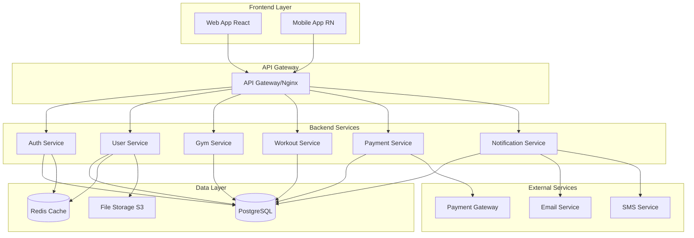

# 🏗️ Arquitectura del Sistema - MyGym

## 📊 Arquitectura General



## 🎯 Patrones Arquitectónicos

### 1. **Arquitectura en Capas (Layered Architecture)**

```
┌─────────────────────────────────────┐
│         Presentation Layer          │
│  (React Components, Pages, Hooks)   │
├─────────────────────────────────────┤
│         Application Layer           │
│    (Services, State Management)     │
├─────────────────────────────────────┤
│          Business Layer             │
│   (API Endpoints, Controllers)      │
├─────────────────────────────────────┤
│          Data Access Layer          │
│     (Repositories, Database)        │
├─────────────────────────────────────┤
│         Infrastructure Layer        │
│  (External APIs, File System, etc)  │
└─────────────────────────────────────┘
```

### 2. **Repository Pattern**
Separación entre lógica de negocio y acceso a datos

```typescript
interface UserRepository {
  findById(id: number): Promise<User | null>
  findByEmail(email: string): Promise<User | null>
  create(user: CreateUserDto): Promise<User>
  update(id: number, data: UpdateUserDto): Promise<User>
  delete(id: number): Promise<void>
}

class PostgresUserRepository implements UserRepository {
  // Implementación específica para PostgreSQL
}
```

### 3. **Service Layer Pattern**
Encapsulación de lógica de negocio

```typescript
class UserService {
  constructor(
    private userRepository: UserRepository,
    private emailService: EmailService
  ) {}

  async createUser(userData: CreateUserDto): Promise<User> {
    // Validaciones de negocio
    // Encriptado de contraseña
    // Creación del usuario
    // Envío de email de bienvenida
  }
}
```

## 🔧 Stack Tecnológico Detallado

### Frontend Stack

#### **Angular 18 Application**
```json
{
  "dependencies": {
    "@angular/core": "^18.0.0",
    "@angular/common": "^18.0.0",
    "@angular/forms": "^18.0.0",
    "@angular/router": "^18.0.0",
    "@angular/platform-browser": "^18.0.0",
    "typescript": "^5.4.0",
    "rxjs": "^7.8.0",
    "primeng": "^17.0.0",
    "primeicons": "^7.0.0",
    "tailwindcss": "^3.4.0",
    "@angular/cdk": "^18.0.0",
    "chart.js": "^4.4.0",
    "ng2-charts": "^6.0.0",
    "date-fns": "^3.6.0"
  }
}
```

#### **State Management Architecture**
```typescript
// Service-based State Management con RxJS
@Injectable({
  providedIn: 'root'
})
export class UserStateService {
  private userSubject = new BehaviorSubject<User | null>(null);
  private loadingSubject = new BehaviorSubject<boolean>(false);
  
  // Signals para datos reactivos (Angular 18)
  user = signal<User | null>(null);
  isLoading = signal<boolean>(false);
  
  // Observables tradicionales
  user$ = this.userSubject.asObservable();
  loading$ = this.loadingSubject.asObservable();
  
  updateUser(user: User) {
    this.userSubject.next(user);
    this.user.set(user); // Update signal
  }
}

// Standalone Component con Signals
@Component({
  selector: 'app-dashboard',
  standalone: true,
  imports: [CommonModule, RouterModule, PrimeNGModule],
  template: `
    <div class="p-4">
      <h1>¡Hola {{ user().firstName }}!</h1>
      @if (isLoading()) {
        <p-progressSpinner />
      }
    </div>
  `
})
export class DashboardComponent {
  private userService = inject(UserStateService);
  
  // Computed signals
  user = this.userService.user;
  isLoading = this.userService.isLoading;
  
  // Effects para side effects
  constructor() {
    effect(() => {
      console.log('User changed:', this.user());
    });
  }
}
```

### Backend Stack

#### **Node.js + Express API**
```json
{
  "dependencies": {
    "express": "^4.18.0",
    "typescript": "^5.0.0",
    "prisma": "^4.15.0",
    "@prisma/client": "^4.15.0",
    "jsonwebtoken": "^9.0.0",
    "bcryptjs": "^2.4.3",
    "joi": "^17.9.0",
    "helmet": "^7.0.0",
    "cors": "^2.8.5",
    "compression": "^1.7.4",
    "rate-limiter-flexible": "^2.4.1",
    "nodemailer": "^6.9.0",
    "multer": "^1.4.5",
    "sharp": "^0.32.0"
  }
}
```

#### **Angular Application Structure**
```
src/
├── app/
│   ├── core/                    # Servicios core y singletons
│   │   ├── auth/
│   │   │   ├── auth.service.ts
│   │   │   ├── auth.guard.ts
│   │   │   └── auth.interceptor.ts
│   │   ├── api/
│   │   │   ├── api.service.ts
│   │   │   └── api.models.ts
│   │   └── state/
│   │       ├── user-state.service.ts
│   │       ├── gym-state.service.ts
│   │       └── notification-state.service.ts
│   ├── shared/                  # Componentes y servicios compartidos
│   │   ├── components/
│   │   │   ├── ui/              # Componentes UI base
│   │   │   │   ├── button/
│   │   │   │   ├── card/
│   │   │   │   └── form-field/
│   │   │   └── layout/          # Componentes de layout
│   │   │       ├── header/
│   │   │       ├── sidebar/
│   │   │       └── footer/
│   │   ├── pipes/
│   │   ├── directives/
│   │   └── validators/
│   ├── features/                # Módulos por funcionalidad
│   │   ├── dashboard/
│   │   │   ├── dashboard.component.ts
│   │   │   └── dashboard.service.ts
│   │   ├── auth/
│   │   │   ├── login/
│   │   │   ├── register/
│   │   │   └── auth.routes.ts
│   │   ├── users/
│   │   │   ├── profile/
│   │   │   ├── list/
│   │   │   └── users.routes.ts
│   │   ├── gym/
│   │   │   ├── check-in/
│   │   │   ├── capacity/
│   │   │   └── gym.routes.ts
│   │   ├── workouts/
│   │   │   ├── plans/
│   │   │   ├── exercises/
│   │   │   └── workouts.routes.ts
│   │   └── classes/
│   │       ├── schedule/
│   │       ├── reservations/
│   │       └── classes.routes.ts
│   ├── app.component.ts         # Root component
│   ├── app.config.ts           # App configuration
│   └── app.routes.ts           # Main routing
├── assets/
├── environments/
└── styles/                     # Global styles y Tailwind
    ├── globals.css
    ├── tailwind.css
    └── primeng-theme.css
```

### Database Architecture

#### **PostgreSQL Schema Organization**
```sql
-- Schema por módulos
CREATE SCHEMA auth;      -- Autenticación y usuarios
CREATE SCHEMA gym;       -- Operaciones del gimnasio
CREATE SCHEMA commerce;  -- Pagos y productos
CREATE SCHEMA analytics; -- Reportes y métricas

-- Tablas principales
CREATE TABLE auth.users (...);
CREATE TABLE gym.memberships (...);
CREATE TABLE gym.check_ins (...);
CREATE TABLE commerce.orders (...);
```

#### **Connection Pool Configuration**
```typescript
const pool = new Pool({
  host: process.env.DB_HOST,
  port: parseInt(process.env.DB_PORT),
  database: process.env.DB_NAME,
  user: process.env.DB_USER,
  password: process.env.DB_PASSWORD,
  min: 2,    // Mínimo de conexiones
  max: 20,   // Máximo de conexiones
  idleTimeoutMillis: 30000,
  connectionTimeoutMillis: 2000,
})
```

## 🔐 Seguridad

### Authentication & Authorization

#### **JWT Token Strategy**
```typescript
interface JWTPayload {
  userId: number
  email: string
  role: UserRole
  membershipId?: number
  iat: number
  exp: number
}

// Token refresh strategy
const ACCESS_TOKEN_EXPIRY = '15m'
const REFRESH_TOKEN_EXPIRY = '7d'
```

#### **Role-Based Access Control (RBAC)**
```typescript
enum UserRole {
  ADMIN = 'admin',
  STAFF = 'staff', 
  TRAINER = 'trainer',
  MEMBER = 'member'
}

const permissions = {
  [UserRole.ADMIN]: ['*'],
  [UserRole.STAFF]: ['read:users', 'write:gym', 'read:reports'],
  [UserRole.TRAINER]: ['read:clients', 'write:workouts'],
  [UserRole.MEMBER]: ['read:own', 'write:own']
}
```

#### **Security Middleware Stack**
```typescript
app.use(helmet()) // Security headers
app.use(cors(corsOptions))
app.use(compression())
app.use(rateLimit({
  windowMs: 15 * 60 * 1000, // 15 minutos
  max: 100 // máximo 100 requests por ventana
}))
```

### Data Protection

#### **Password Security**
```typescript
// Bcrypt con salt rounds altos
const SALT_ROUNDS = 12

const hashPassword = async (password: string): Promise<string> => {
  return bcrypt.hash(password, SALT_ROUNDS)
}
```

#### **Data Encryption**
```typescript
// Encriptación para datos sensibles
const encrypt = (text: string): string => {
  const cipher = crypto.createCipher('aes-256-cbc', SECRET_KEY)
  let encrypted = cipher.update(text, 'utf8', 'hex')
  encrypted += cipher.final('hex')
  return encrypted
}
```

## 📊 Performance & Caching

### Frontend Performance

#### **Code Splitting**
```typescript
// Lazy loading de rutas
const Dashboard = lazy(() => import('./pages/Dashboard'))
const Workouts = lazy(() => import('./pages/Workouts'))
const Classes = lazy(() => import('./pages/Classes'))

// Route-based splitting
<Routes>
  <Route path="/dashboard" element={<Suspense><Dashboard /></Suspense>} />
  <Route path="/workouts" element={<Suspense><Workouts /></Suspense>} />
</Routes>
```

#### **React Query Caching Strategy**
```typescript
// Configuración de cache por tipo de dato
const queryConfig = {
  user: { staleTime: 5 * 60 * 1000 },      // 5 min
  workouts: { staleTime: 2 * 60 * 1000 },   // 2 min
  classes: { staleTime: 30 * 1000 },        // 30 seg
  realtime: { staleTime: 0 }                 // Sin cache
}
```

### Backend Performance

#### **Redis Caching Strategy**
```typescript
const cacheStrategy = {
  // Datos de usuario (TTL: 15 minutos)
  user: 15 * 60,
  
  // Datos de gimnasio (TTL: 5 minutos)
  gym_capacity: 5 * 60,
  
  // Clases y horarios (TTL: 30 minutos)
  classes: 30 * 60,
  
  // Configuración (TTL: 1 hora)
  config: 60 * 60
}
```

#### **Database Query Optimization**
```sql
-- Índices estratégicos
CREATE INDEX CONCURRENTLY idx_check_ins_user_date 
ON check_ins (user_id, check_in_time);

CREATE INDEX CONCURRENTLY idx_memberships_active 
ON memberships (status, end_date) 
WHERE status = 'active';
```

## 🚀 Deployment & DevOps

### Container Architecture

#### **Docker Configuration**
```dockerfile
# Frontend Dockerfile
FROM node:18-alpine AS builder
WORKDIR /app
COPY package*.json ./
RUN npm ci --only=production
COPY . .
RUN npm run build

FROM nginx:alpine
COPY --from=builder /app/dist /usr/share/nginx/html
COPY nginx.conf /etc/nginx/nginx.conf
```

```dockerfile
# Backend Dockerfile
FROM node:18-alpine
WORKDIR /app
COPY package*.json ./
RUN npm ci --only=production
COPY . .
RUN npm run build
EXPOSE 3000
CMD ["npm", "start"]
```

#### **Docker Compose (Development)**
```yaml
version: '3.8'
services:
  frontend:
    build: ./frontend
    ports:
      - "3000:3000"
    volumes:
      - ./frontend:/app
    
  backend:
    build: ./backend
    ports:
      - "3001:3001"
    environment:
      - NODE_ENV=development
      - DB_HOST=postgres
    depends_on:
      - postgres
      - redis
    
  postgres:
    image: postgres:15
    environment:
      POSTGRES_DB: mygym
      POSTGRES_USER: dev
      POSTGRES_PASSWORD: dev123
    volumes:
      - postgres_data:/var/lib/postgresql/data
    
  redis:
    image: redis:7-alpine
    volumes:
      - redis_data:/data
```

### CI/CD Pipeline

#### **GitHub Actions Workflow**
```yaml
name: Deploy to Production
on:
  push:
    branches: [main]

jobs:
  test:
    runs-on: ubuntu-latest
    steps:
      - uses: actions/checkout@v3
      - uses: actions/setup-node@v3
      - run: npm ci
      - run: npm run test
      - run: npm run lint
      
  build-and-deploy:
    needs: test
    runs-on: ubuntu-latest
    steps:
      - name: Build and push Docker images
        # Build frontend y backend
      - name: Deploy to production
        # Deploy usando docker-compose
```

## 📈 Monitoring & Observability

### Application Monitoring

#### **Logging Strategy**
```typescript
import winston from 'winston'

const logger = winston.createLogger({
  level: 'info',
  format: winston.format.combine(
    winston.format.timestamp(),
    winston.format.errors({ stack: true }),
    winston.format.json()
  ),
  transports: [
    new winston.transports.File({ filename: 'error.log', level: 'error' }),
    new winston.transports.File({ filename: 'combined.log' }),
    new winston.transports.Console()
  ]
})
```

#### **Health Checks**
```typescript
app.get('/health', async (req, res) => {
  const healthcheck = {
    uptime: process.uptime(),
    message: 'OK',
    timestamp: Date.now(),
    checks: {
      database: await checkDatabase(),
      redis: await checkRedis(),
      external_apis: await checkExternalAPIs()
    }
  }
  
  res.status(200).json(healthcheck)
})
```

#### **Angular 18 Features & Configuration**
```typescript
// app.config.ts - Application configuration
import { ApplicationConfig, provideZoneChangeDetection } from '@angular/core';
import { provideRouter } from '@angular/router';
import { provideHttpClient, withInterceptors } from '@angular/common/http';
import { provideAnimations } from '@angular/platform-browser/animations';

export const appConfig: ApplicationConfig = {
  providers: [
    provideZoneChangeDetection({ eventCoalescing: true }),
    provideRouter(routes),
    provideHttpClient(withInterceptors([authInterceptor, errorInterceptor])),
    provideAnimations(),
    // PrimeNG configuration
    MessageService,
    ConfirmationService,
    // Custom services
    ApiService,
    AuthService,
    NotificationService
  ]
};

// Reactive Forms Configuration
@Component({
  selector: 'app-login',
  standalone: true,
  imports: [ReactiveFormsModule, InputTextModule, ButtonModule],
  template: `
    <form [formGroup]="loginForm" (ngSubmit)="onSubmit()">
      <div class="field">
        <input 
          pInputText 
          formControlName="email"
          placeholder="Email"
          class="w-full"
        />
      </div>
      <div class="field">
        <input 
          pInputText 
          type="password"
          formControlName="password"
          placeholder="Contraseña"
          class="w-full"
        />
      </div>
      <p-button 
        type="submit"
        label="Iniciar Sesión"
        [disabled]="loginForm.invalid"
        styleClass="w-full"
      />
    </form>
  `
})
export class LoginComponent {
  private fb = inject(FormBuilder);
  private authService = inject(AuthService);
  
  loginForm = this.fb.group({
    email: ['', [Validators.required, Validators.email]],
    password: ['', [Validators.required, Validators.minLength(8)]]
  });
  
  onSubmit() {
    if (this.loginForm.valid) {
      this.authService.login(this.loginForm.value);
    }
  }
}

// Guards with Angular 18
export const authGuard: CanActivateFn = (route, state) => {
  const authService = inject(AuthService);
  const router = inject(Router);
  
  return authService.isAuthenticated() || router.createUrlTree(['/login']);
};

// Routing configuration
export const routes: Routes = [
  {
    path: '',
    redirectTo: '/dashboard',
    pathMatch: 'full'
  },
  {
    path: 'login',
    loadComponent: () => import('./features/auth/login/login.component').then(m => m.LoginComponent)
  },
  {
    path: 'dashboard',
    loadComponent: () => import('./features/dashboard/dashboard.component').then(m => m.DashboardComponent),
    canActivate: [authGuard]
  },
  {
    path: 'workouts',
    loadChildren: () => import('./features/workouts/workouts.routes').then(m => m.workoutRoutes),
    canActivate: [authGuard]
  }
];
```

## 🔄 Backup & Disaster Recovery

### Database Backup Strategy
```bash
# Backup diario automático
0 2 * * * pg_dump -h localhost -U postgres mygym > /backups/mygym_$(date +%Y%m%d).sql

# Backup semanal a almacenamiento remoto
0 3 * * 0 aws s3 cp /backups/mygym_$(date +%Y%m%d).sql s3://mygym-backups/
```

### Recovery Procedures
1. **Database Recovery**: Restore desde backup más reciente
2. **Application Recovery**: Redeploy desde imagen Docker stable
3. **Data Consistency**: Verificación de integridad post-recovery

---

*Documento actualizado: 9 de junio de 2025*
