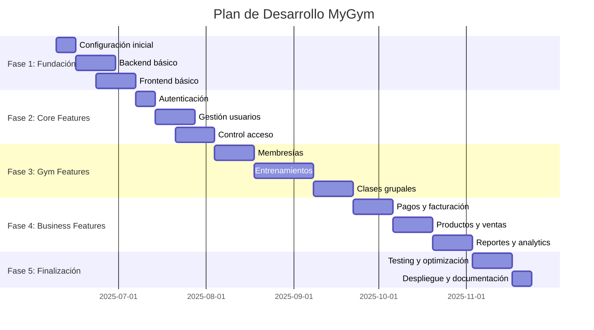

# 📅 Plan de Desarrollo - MyGym

## 🎯 Visión General del Proyecto

### Duración Estimada: **16-20 semanas**
### Metodología: **Desarrollo Ágil con Sprints de 2 semanas**
### Equipo: **1 Desarrollador Principal + IA Assistant**

## 📊 Fases del Proyecto

---

## 🏗️ Fase 1: Fundación (Semanas 1-4)

### Sprint 1: Configuración Inicial (Semana 1)
**Objetivo**: Establecer la base del proyecto

#### 📋 Tareas
- [ ] **Configuración del entorno de desarrollo**
  - Inicializar repositorio Git
  - Configurar estructura de carpetas
  - Setup de Docker para desarrollo local
  - Configurar VSCode con extensiones necesarias

- [ ] **Base de datos**
  - Instalación y configuración de PostgreSQL
  - Creación de esquemas iniciales
  - Setup de Prisma ORM
  - Migraciones iniciales

- [ ] **Herramientas de desarrollo**
  - Configuración de ESLint y Prettier
  - Setup de testing framework
  - Configuración de CI/CD básico
  - Documentation setup (Swagger)

#### 🎯 Entregables
- Proyecto inicializado con estructura definida
- Base de datos funcionando localmente
- Pipeline de CI/CD básico funcionando

### Sprint 2: Backend Core (Semanas 2-3)
**Objetivo**: API básica funcionando

#### 📋 Tareas
- [ ] **API Foundation**
  - Setup Express.js + TypeScript
  - Configuración de middleware básico
  - Estructura de rutas y controladores
  - Manejo de errores centralizado

- [ ] **Core Models**
  - Modelo de Usuario
  - Modelo de Membresía
  - Relaciones básicas entre entidades
  - Validaciones de datos

- [ ] **Basic CRUD Operations**
  - Endpoints de usuarios
  - Endpoints de membresías
  - Middleware de validación
  - Tests unitarios básicos

#### 🎯 Entregables
- API REST básica funcionando
- Documentación de API (Swagger)
- Tests unitarios pasando

### Sprint 3: Frontend Foundation (Semanas 3-4)
**Objetivo**: Aplicación Angular 18 básica

#### 📋 Tareas  
- [ ] **Angular 18 Setup**
  - Crear aplicación con Angular CLI + TypeScript
  - Configurar Tailwind CSS + PrimeNG
  - Setup de Angular Router con Guards
  - Configurar Standalone Components

- [ ] **State Management Setup**
  - Configurar servicios con RxJS
  - Setup de signals para estado reactivo
  - Configurar interceptors HTTP
  - Manejo de errores centralizado

- [ ] **UI Components Base**
  - Sistema de diseño con Tailwind + PrimeNG
  - Componentes reutilizables (Button, Card, FormField)
  - Layout principal con Sidebar
  - Navegación responsive

- [ ] **Basic Pages & Routing**
  - Lazy loading routes setup
  - Página de login con Reactive Forms
  - Dashboard básico con Signals
  - Página de perfil
  - Guards para rutas protegidas

#### 🎯 Entregables
- Aplicación Angular 18 funcionando
- Sistema de componentes UI con PrimeNG
- Routing y navegación funcionando
- Reactive Forms configurados

---

## 🔐 Fase 2: Autenticación y Usuarios (Semanas 5-8)

### Sprint 4: Sistema de Autenticación (Semana 5)
**Objetivo**: Login y registro funcionando

#### 📋 Tareas
- [ ] **Backend Auth**
  - JWT implementation
  - Bcrypt para passwords
  - Middleware de autenticación
  - Refresh token strategy

- [ ] **Frontend Auth**
  - Formularios de login/registro con Reactive Forms
  - Manejo de tokens con interceptors
  - Guards para rutas protegidas
  - Auth service con RxJS + Signals

- [ ] **Security**
  - Validación de contraseñas
  - Rate limiting
  - CORS configuration
  - Security headers

#### 🎯 Entregables
- Login/registro funcionando
- Rutas protegidas
- Manejo seguro de tokens

### Sprint 5-6: Gestión de Usuarios (Semanas 6-7)
**Objetivo**: CRUD completo de usuarios

#### 📋 Tareas
- [ ] **User Management Backend**
  - CRUD completo de usuarios
  - Roles y permisos
  - Perfil de usuario completo
  - Upload de imágenes

- [ ] **User Management Frontend**
  - Perfil de usuario editable con Reactive Forms
  - Gestión de información médica
  - Upload de foto de perfil con PrimeNG
  - Configuración de cuenta con Angular Signals

- [ ] **Admin Features**
  - Lista de usuarios (admin)
  - Gestión de roles
  - Búsqueda y filtros
  - Acciones en lote

#### 🎯 Entregables
- Gestión completa de usuarios
- Panel de admin funcional
- Upload de archivos funcionando

### Sprint 7: Control de Acceso (Semana 8)
**Objetivo**: Check-in/out system

#### 📋 Tareas
- [ ] **Access Control Backend**
  - API de check-in/check-out
  - Validación de membresía
  - Tracking de capacidad
  - Historial de accesos

- [ ] **Access Control Frontend**
  - Interfaz de check-in
  - QR code scanner (simulado)
  - Dashboard de capacidad
  - Historial personal

#### 🎯 Entregables
- Sistema de check-in funcionando
- Tracking de capacidad en tiempo real
- Historial de accesos

---

## 🏋️‍♂️ Fase 3: Funcionalidades del Gym (Semanas 9-14)

### Sprint 8-9: Sistema de Membresías (Semanas 9-10)
**Objetivo**: Gestión completa de membresías

#### 📋 Tareas
- [ ] **Membership Backend**
  - Tipos de membresía
  - Asignación de membresías
  - Validación de vencimientos
  - Notificaciones automáticas

- [ ] **Membership Frontend**
  - Catálogo de membresías
  - Panel de mi membresía
  - Proceso de renovación
  - Historial de pagos

#### 🎯 Entregables
- Sistema de membresías completo
- Renovación automática
- Notificaciones de vencimiento

### Sprint 10-12: Sistema de Entrenamientos (Semanas 11-13)
**Objetivo**: Planes y seguimiento de entrenamientos

#### 📋 Tareas
- [ ] **Workout System Backend**
  - Catálogo de ejercicios
  - Planes de entrenamiento
  - Tracking de progreso
  - Estadísticas de rendimiento

- [ ] **Workout System Frontend**
  - Biblioteca de ejercicios
  - Rutina del día
  - Seguimiento de progreso
  - Estadísticas visuales

- [ ] **Trainer Features**
  - Creación de planes
  - Asignación a clientes
  - Seguimiento de progreso
  - Comunicación con clientes

#### 🎯 Entregables
- Sistema de entrenamientos funcional
- Tracking de progreso completo
- Herramientas para entrenadores

### Sprint 13: Clases Grupales (Semana 14)
**Objetivo**: Reserva y gestión de clases

#### 📋 Tareas
- [ ] **Classes Backend**
  - Programación de clases
  - Sistema de reservas
  - Lista de espera
  - Gestión de instructores

- [ ] **Classes Frontend**
  - Calendario de clases
  - Sistema de reservas
  - Mis reservas
  - Notificaciones de clases

#### 🎯 Entregables
- Sistema de clases grupales
- Reservas funcionando
- Lista de espera automática

---

## 💰 Fase 4: Funcionalidades de Negocio (Semanas 15-20)

### Sprint 14-15: Pagos y Facturación (Semanas 15-16)
**Objetivo**: Sistema de pagos completo

#### 📋 Tareas
- [ ] **Payment System Backend**
  - Integración con gateway de pagos
  - Generación de facturas
  - Historial de pagos
  - Manejo de fallas en pagos

- [ ] **Payment System Frontend**
  - Proceso de pago
  - Historial de transacciones
  - Descarga de facturas
  - Métodos de pago

#### 🎯 Entregables
- Sistema de pagos funcionando
- Facturación automática
- Integración con pasarela de pagos

### Sprint 16: Productos y Ventas (Semana 17)
**Objetivo**: E-commerce básico

#### 📋 Tareas
- [ ] **Commerce Backend**
  - Catálogo de productos
  - Carrito de compras
  - Órdenes de compra
  - Gestión de inventario

- [ ] **Commerce Frontend**
  - Catálogo de productos
  - Carrito y checkout
  - Historial de compras
  - Estado de órdenes

#### 🎯 Entregables
- Sistema de ventas funcionando
- Gestión de inventario básica
- Proceso de compra completo

### Sprint 17: Reportes y Analytics (Semana 18)
**Objetivo**: Dashboard administrativo completo

#### 📋 Tareas
- [ ] **Analytics Backend**
  - Métricas de negocio
  - Reportes automáticos
  - Exportación de datos
  - KPIs del gimnasio

- [ ] **Analytics Frontend**
  - Dashboard administrativo
  - Gráficos y métricas
  - Reportes exportables
  - Filtros y períodos

#### 🎯 Entregables
- Dashboard de admin completo
- Reportes exportables
- Métricas en tiempo real

---

## 🚀 Fase 5: Finalización (Semanas 19-21)

### Sprint 18-19: Testing y Optimización (Semanas 19-20)
**Objetivo**: Aplicación lista para producción

#### 📋 Tareas
- [ ] **Testing Comprehensive**
  - Tests unitarios con Jest
  - Tests de integración de Angular
  - Tests end-to-end con Playwright o Cypress
  - Testing de componentes PrimeNG

- [ ] **Performance Optimization**
  - Optimización de queries
  - Caching strategies
  - Bundle optimization
  - Image optimization

- [ ] **Bug Fixes**
  - Fix de bugs encontrados
  - Mejoras de UX
  - Optimización mobile
  - Accessibility improvements

#### 🎯 Entregables
- Suite de tests completa
- Performance optimizado
- Bugs críticos resueltos

### Sprint 20: Despliegue (Semana 21)
**Objetivo**: Aplicación en producción

#### 📋 Tareas
- [ ] **Production Setup**
  - Configuración de servidores
  - Setup de base de datos
  - Configuración de dominio
  - SSL certificates

- [ ] **Deployment**
  - Deploy de backend
  - Deploy de frontend
  - Configuración de CDN
  - Monitoring setup

- [ ] **Documentation**
  - Manual de usuario
  - Manual de administrador
  - Documentación técnica
  - Guías de despliegue

#### 🎯 Entregables
- Aplicación en producción
- Documentación completa
- Monitoring configurado

---

## 📊 Métricas de Éxito

### Métricas Técnicas
- **Code Coverage**: > 80%
- **Performance**: < 3s load time
- **Uptime**: > 99%
- **Security**: 0 vulnerabilidades críticas

### Métricas de Negocio
- **User Adoption**: Facilidad de uso medida
- **Feature Completeness**: 100% de requisitos implementados
- **Admin Satisfaction**: Herramientas administrativas completas
- **Scalability**: Preparado para 500+ usuarios

## 🔄 Estrategia de Desarrollo

### Daily Workflow
1. **Planning** (30 min): Revisar tareas del día
2. **Development** (6-7 horas): Coding con breaks regulares
3. **Testing** (1 hora): Tests y QA
4. **Documentation** (30 min): Actualizar docs

### Weekly Workflow
- **Lunes**: Planning del sprint, definir objetivos
- **Martes-Jueves**: Desarrollo intensivo
- **Viernes**: Testing, refactoring, documentación
- **Fin de semana**: Research, learning, preparación

### Tools & Processes
- **Version Control**: Git con feature branches
- **Code Review**: Self-review + AI assistance
- **Testing**: Automated tests + manual QA
- **Documentation**: Continuous updates

## 🚨 Riesgos y Mitigaciones

### Riesgos Técnicos
- **Complejidad del proyecto**: Dividir en tareas pequeñas
- **Integración de APIs**: Crear mocks y tests
- **Performance issues**: Profiling continuo

### Riesgos de Tiempo
- **Scope creep**: Mantener focus en MVP
- **Estimaciones optimistas**: Buffer del 20% en cada sprint
- **Blocking issues**: Tener tareas alternativas

### Estrategias de Mitigación
- **MVP First**: Implementar funcionalidad básica primero
- **Iterative Development**: Mejoras continuas
- **Documentation**: Mantener docs actualizados
- **Backup Plans**: Tener alternativas para features complejas

---

*Documento actualizado: 9 de junio de 2025*
